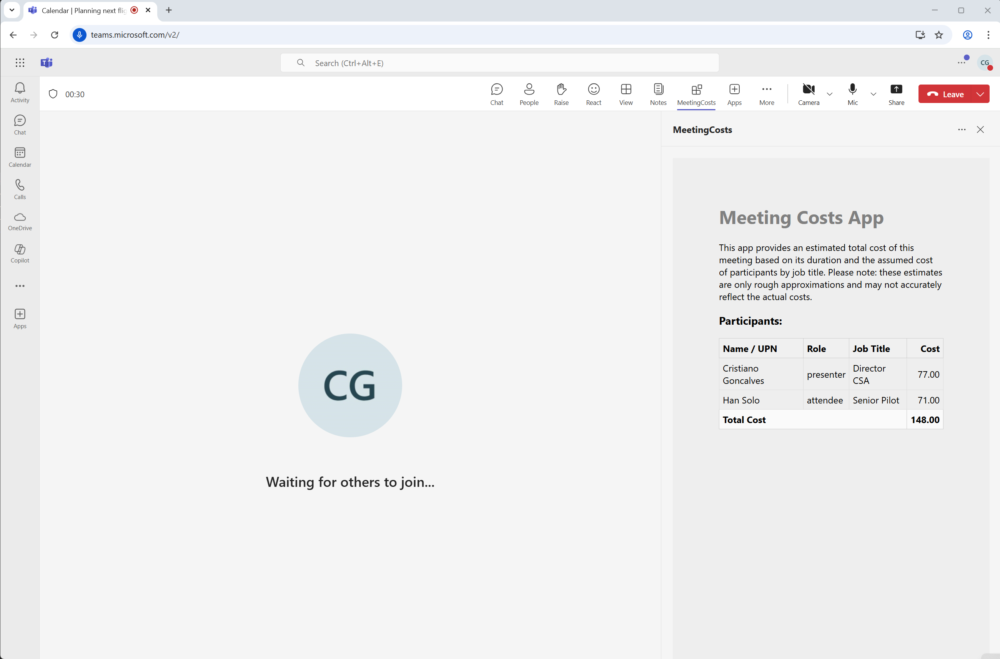

# MeetingCosts - A Teams Meeting App to estimate meeting costs
This Teams meeting app provides an estimated total cost of a meeting based on its duration and the assumed cost of participants by job title. It was built using [Microsoft 365 Agents Toolkit](https://aka.ms/teams-toolkit) and [Teams Client Library](https://learn.microsoft.com/en-us/javascript/api/overview/msteams-client?view=msteams-client-js-latest).

It needs to be added in a Teams meeting and will detect the meeting duration and participants automatically. The app will use a predefined cost for each job title to estimate the total cost of the meeting.

The app uses a Azure Logic App to handle the business logic and can be easily customized to fit your needs. If you need to customize the cost per job title, you can edit the logic app workflow in Azure Portal and include a specific action to update the cost per job title or other logic you may need.

A possible improvement to this app would be activate the MCP server configuration in the logic apps so we can turn the logic app into a tool in the MCP server and then have a Copilot Agent to interact with the logic app. This way we can have a more interactive experience with the app and have a Copilot Agent to help us with the meeting costs estimation when added in a meeting.

> App Caching was configured in this sample to reduce the reload time of your app in a meeting. To learn about limitations and available scopes, please check [Enable app caching for your tab app](https://aka.ms/teamsfx-app-caching).

## Prerequisites

- [Node.js](https://nodejs.org/), supported versions: 18, 20, 22
- A Microsoft 365 tenant in which you have permission to upload Teams apps. You can get a free Microsoft 365 developer tenant by joining the [Microsoft 365 developer program](https://developer.microsoft.com/en-us/microsoft-365/dev-program).
- [Microsoft 365 Agents Toolkit Visual Studio Code Extension](https://aka.ms/teams-toolkit) version 5.0.0 and higher or [Microsoft 365 Agents Toolkit CLI](https://aka.ms/teams-toolkit-cli)
- Follow the instruction to [create a meeting in Teams](https://support.microsoft.com/en-us/office/create-a-meeting-in-teams-for-personal-and-small-business-use-eb571219-517b-49bf-afe1-4fff091efa85). Then in the Calendar you can find the meeting you just created. Double click the meeting will open the meeting details, and will enable the meeting app to be added in this meeting in later steps.
- Azure subscription. If you don't have one, you can create a free account by following the instruction [here](https://azure.microsoft.com/en-us/free/).

## Minimal path to awesome

### Configuration Steps

1. You will need a new App Registration in Azure AD to enable authentication for your app. You can follow the instruction in [Register an application with the Microsoft identity platform](https://learn.microsoft.com/en-us/azure/active-directory/develop/quickstart-register-app) to create a new App Registration in your Azure AD tenant.
1. After you created the App Registration, please make sure you have added the following API permissions in your App Registration:
    - Microsoft Graph
        - User.Read
        - Chat.Read.All
        - Chat.ReadBasic.All
        - OnlineMeetings.Read.All
1. Make sure you have granted admin consent for the API permissions you just added.
1. Create a new secret for your App Registration, and copy the secret value, you will need it in later steps.
1. Create the logic app in Azure Portal by following the instruction in [Create a logic app](https://learn.microsoft.com/en-us/azure/logic-apps/quickstart-create-first-logic-app-workflow?tabs=consumption). You can name your logic app as `meetingcosts-logicapp-<your-initials>`.
1. After you created the logic app, open the logic app in Azure Portal, and click on `Edit` button to edit the logic app.
1. Follow instructions of the appropriate section below to import the logic app workflow definition.
1. Edit the .env.local file and update the following environment variables with your own values:
    - AAD_APP_ID
    - AAD_LOGIC_APP_URL

### Run the app locally

1. In Visual Studio Code: Start debugging the project by hitting the `F5` key in your keyboard. Alternatively open the `Run and Debug Activity` panel(Ctrl+Shift+D) in Visual Studio Code and click the `Run and Debug` green arrow button.
1. The Teams web client will launch in your browser, click the small arrow sit aside the `Add` button and select `Add to a meeting`, then select the meeting you just created.
1. Click `Set up a tab` in the next step, it will take you to the meeting configuration page.
1. In the configuration page, click `Save`, this may take several minutes, and then you will see the meeting chat tab.
1. Click `Join` to join the meeting.
1. Select the tab (default name is `My Tab`) in the bar, you will see a side panel tab in the meeting.

### Deploy the app to Azure

Deploy your project to Azure by following these steps:

1. Open Microsoft 365 Agents Toolkit in Visual Studio Code, and sign in your Azure account by clicking the `Sign in to Azure` in the `ACCOUNTS` section from sidebar.
1. After you signed in, select a subscription under your account. The Microsoft 365 Agents Toolkit will use this subscription to provision Azure resources to host you app.
1. Open the Microsoft 365 Agents Toolkit and click `Provision` in the `LIFECYCLE` section. Alternatively open the command palette(Ctrl+Shift+P) and type: `Microsoft 365 Agents: Provision` command.
1. Open the Microsoft 365 Agents Toolkit and click `Deploy` in the `LIFECYCLE` section. Alternatively open the command palette(Ctrl+Shift+P) and type: `Microsoft 365 Agents: Deploy` command.

> Note: Provision Azure cloud resources and deploy to Azure may cause charges to your Azure Subscription.

### Preview the app in Teams

After you have completed the provision and deploy steps in `Deploy the app to Azure` section, you can preview your app in Teams client by following steps below:

1. Open the `Run and Debug Activity` panel from sidebar, or use short key Ctrl+Shift+D.
1. Select `Launch Remote (Edge)` or `Launch Remote (Chrome)` in the launch configuration (a dropdown selection in the upper-left corner).
1. Press the `Start Debugging` (small green arrow) button to launch your app, the Teams web client will be automatically opened in your browser, where you will see your app running remotely from Azure.
